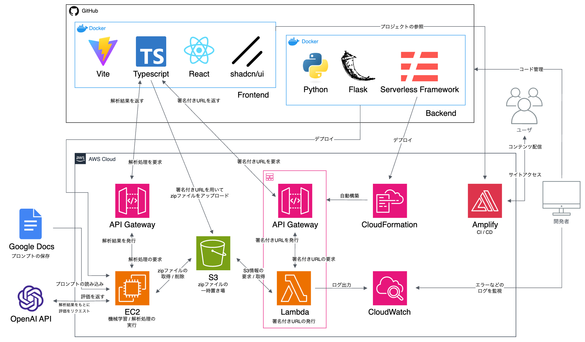

# Thor-Web-App-BE

- 本 web アプリは，本研究のアルゴリズムや推定処理を誰でも利用できるようにするとともに，結果を AI を用いてフィードバックできるようにするものである．また，ローカルで解析を行うこともできる．

- 本リポジトリでは，アプリの目に見えない処理の部分を実装しており，基本的には全て AWS 上で動作するようになっている．環境変数さえ用意すればローカルでも動かすことができる．関数単位で細かく処理を分けているため，研究ソースコードよりかなりわかりやすい．

- [フロントエンドリポジトリ](https://github.com/273Do/Thor-Web-App-Frontend)

## 🚚 開発環境・使用技術・ツール

<!-- <H3>x日間(1日あたりy~z時間)</H3> -->

<H3>BE

 

<h3>環境，コード管理

 
 

<h3>外部サービス

 
 

<h3>ストレージ，デプロイ

  
  
  

<h3>ロゴ

  
  

## 🚚 システム構成図

## 🚚 動作確認済み端末・OS

- macOS Sequoia 15.0
- AWS Lmabda，AWS EC2

## 🚚 アプリ構築・起動

> 環境構築について記載しています．本番協でも基本的には同じです．

環境構築

### 環境構築

1. Git と Docker Desktop をインストールしてください．

2. 任意のディレクトリで`git clone https://github.com/273Do/Thor.git`を実行してください．

3. ルートディレクトリと`thor-web-app-beディレクトリ`に.env ファイルを作成し，環境変数を設定してください．(内容については開発者に問い合わせください．)
4. 作成されたプロジェクトの`Dockerfile`が存在するディレクトリで，`docker compose build`でイメージを作成してください．

5. 引き続き，`docker compose up -d`でコンテナを起動してください．

6. `docker exec -it thor_web_app_be /bin/bash`を実行してコンテナの中に入ってください．

7. `aws configure`で aws cli の設定をしてください．

8. 以降はコンテナ内で python3 コマンドを実行していただけます．必要なライブラリは requirements.txt に記載されているものが自動でインストールされますが，必要なライブラリが無いとエラーが吐かれた場合は`pip3`で手動でインストールしてください．

9. コンテナから抜ける場合は`exit`を実行，コンテナを終了させる場合は`docker compose down`を実行してください．

## 🚚 API 利用手順

> API の利用手順について記載しています．本番では`http://localhost:5000`ではなく正しいエンドポイントを使用してください．

ローカル環境でのアプリの実行

1.  REST API のテストができるようなツールを導入してください．  
    VSCode の拡張機能版 Postman，Thunder Client などを入れるといいです．

2.  アプリのリクエスト順序通りに API を叩いていきます．

API 利用手順

## 1. 署名付き URL を発行

### HTTP リクエスト

| 項目   | 内容                                         |
| ------ | -------------------------------------------- |
| Method | POST                                         |
| URL    | `http://localhost:5000/get_presigned_url`    |
| Header | `Content-Type: application/json`             |
| Body   | [json]`{"file_name": "書き出したデータ.zip"} |

### レスポンス

- UUID とアップロード用の URL が返されます。

---

## 2. 署名付き URL を使用して ZIP を送信

### HTTP リクエスト

| 項目   | 内容                            |
| ------ | ------------------------------- |
| Method | PUT                             |
| URL    | 先ほど取得した URL              |
| Header | `Content-Type: application/zip` |
| Body   | [binary]ZIP ファイル            |

### レスポンス

- アップロードが成功すれば、`200` ステータスが返されます。

---

## 3. 解析処理を要求する

### HTTP リクエスト

| 項目   | 内容                                 |
| ------ | ------------------------------------ |
| Method | POST                                 |
| URL    | `http://localhost:5000/analysis`     |
| Header | `Content-Type: application/json`     |
| Body   | [json]                               |
|        | `{                                   |
|        | "UUID": "先ほど取得した UUID",       |
|        | "file_name": "書き出したデータ.zip", |
|        | "habit": "x",                        |
|        | "bed_answer": "y",                   |
|        | "wake_answer": "z"                   |
|        | }`                                   |

※リクエスト内容

- `habit`: 夜更かししたかどうか (x：`0` or `1`)
- `bed_answer`: アンケート回答 (y：`0〜4`)
- `wake_answer`: アンケート回答 (z：`0〜2`)

### レスポンス

- 解析結果が返されます。

---

     

## 🚚 ブランチの説明

`develop`：以下のソースコードまとめてがアップロードされています．  
`feature/#12_only_lambda_functions`：AWS Lambda に搭載するソースコード(署名付き URL の取得)がアップロードされています．  
`feature/#13_only_ec2_functions`：AWS EC2 に搭載するソースコード(解析処理やフィードバック処理)がアップロードされています．

## 🚚 各種関数の説明

## 🚚 クレジット・免責事項

- 開発：273\*
- This source code contains a partially modified version of [**applehealthdata**](https://github.com/tdda/applehealthdata) .
- この作成物および同梱物を使用したことによって生じたすべての障害・損害・不具合等に関しては，私と私の関係者および私の所属するいかなる団体・組織とも，一切の責任を負いません．各自の責任においてご使用ください．
